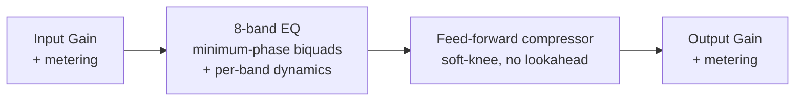

# Zero EQ

> **AI-assisted project.** This codebase was created with [Claude](https://claude.com/claude-code)
> (Anthropic), directed and reviewed by a human author. The DSP has been verified
> analytically (filter math checked against the RBJ/Butterworth cookbook formulas) and
> against real audio (throwaway numeric test harnesses processing real signals through
> the actual shipped processor class, not just static curve math), `pluginval` passes
> clean on both VST3 and AU, and it's been loaded and hosted successfully in REAPER.
> It has **not** been used on real hardware in a live signal chain yet. Review before
> use on live gear.

A zero-added-latency parametric EQ + compressor VST3/AU plugin, built with JUCE.

## Goals

- **Zero added latency** — every filter is minimum-phase IIR (biquads); no lookahead,
  no linear-phase FFT convolution, no internal buffering beyond the host's block size.
  Safe to track through in a live/monitoring signal chain.
- **Node-based curve workflow** — draggable per-band nodes over a live pre/post spectrum
  analyzer. Drag = frequency/gain, scroll = Q, double-click = add/toggle a band.
- **Dynamic EQ bands** — any gain-having band (Bell/Shelf/Tilt) can be switched into
  dynamic mode: it gets its own threshold/ratio/attack/release/range and behaves as a
  frequency-selective compressor (duck when that band gets loud) or expander (boost
  when that band gets quiet), instead of sitting at a fixed static gain. Detection runs
  on the signal already in the chain — no lookahead, no added latency.
- **Musical "Vintage" character mode** — an optional proportional-Q behaviour per band
  (bandwidth widens as you push more gain), approximating the interactive feel of
  passive/console-style EQs such as Cranborne Audio's Harmonic EQ. This is an original
  approximation of that *behaviour*, not a circuit model or clone of any specific product.
- **Input/output trim** with metering, plus a post-EQ feed-forward compressor
  (soft-knee, peak/RMS detection, no lookahead — also zero added latency).

## Roadmap

- [x] **Dynamic EQ bands** — shipped. Per-band threshold/ratio/attack/release/range,
  selectable Downward (duck) or Upward (boost) direction, internal detection only
  (no external sidechain input yet).
- [ ] **Harmonic-based EQ** — a musical/character-driven EQ mode that shapes harmonic
  content rather than just spectral tilt, extending past the current Modern/Vintage
  proportional-Q character system. The next major feature.

Both need to land without compromising the zero-added-latency guarantee that's
the whole point of this plugin.

## Signal chain



Each EQ band's own dynamic detector reads the signal as it arrives at that band's
position in the chain (post every earlier band, pre this one) and modulates that
band's gain in real time — still just one pass through the chain, no lookahead.

## Building

Requires CMake 3.22+ and a C++20 compiler (Xcode Command Line Tools on macOS).
JUCE is fetched automatically via CMake `FetchContent` on first configure.

```sh
cmake -B build -G Ninja -DCMAKE_BUILD_TYPE=Release
cmake --build build
```

Build products (VST3 / AU / Standalone) land in `build/ZeroEQ_artefacts/`.

## EQ bands

Each of the 8 bands supports: Bell, Low Shelf, High Shelf, High Pass, Low Pass, Notch,
Band Pass, and Tilt Shelf, with a selectable slope (12/24/36/48 dB/oct) for the HP/LP
types and a Modern/Vintage character switch for the rest.

Bell/Shelf/Tilt bands can additionally be switched into **dynamic mode**: threshold,
ratio, attack, release, and a max-range clamp, with a Downward (duck) or Upward (boost)
direction. The detector filters a copy of the signal through a type-appropriate analysis
shape (band-pass at the band's freq/Q for Bell/Tilt, high-pass at the corner for High
Shelf, low-pass at the corner for Low Shelf) to isolate "the region this band affects,"
then envelope-follows that to drive the gain modulation. This is a practical
approximation for isolating a band's spectral region, not a claim of matching any
specific commercial dynamic EQ's exact detection algorithm.

## Status

Phase 2: DSP engine, dynamic EQ, and full interactive GUI (spectrum analyzer, draggable
curve, band/compressor/IO panels, live dynamic-gain indicators). Verified via
`pluginval` (VST3 + AU, strictness 5, clean), hosted successfully in REAPER, and
checked against real audio through the actual shipped processor class — see open items
below for what's still outstanding.

### Known limitations / next steps

- [ ] Add a preset / factory-bank system.
- [ ] Ballistics-accurate metering (true-peak / standardized VU/PPM) — current meters are simple peak reads.
- [ ] Add a GUI screenshot to this README.
- [ ] Dynamic EQ: no external sidechain input yet (internal detection only).
- [ ] Not yet tested against real (non-silent) audio hardware in a live signal chain.
- No linear-phase mode — intentionally out of scope (zero latency was the explicit goal).
