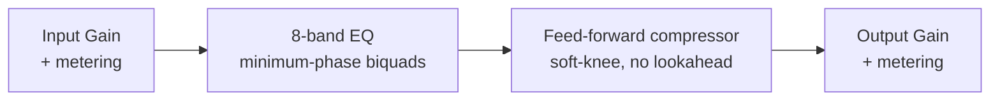

# Zero EQ

> **AI-assisted project.** This codebase was created with [Claude](https://claude.com/claude-code)
> (Anthropic), directed and reviewed by a human author. The DSP has been verified
> analytically (filter math checked against the RBJ/Butterworth cookbook formulas via
> a standalone numeric test) and the GUI has been visually verified in a running
> Standalone build, but this has **not been validated against real hardware, a real
> DAW host, or `pluginval`**. Review before use on live gear.

A zero-added-latency parametric EQ + compressor VST3/AU plugin, built with JUCE.

## Goals

- **Zero added latency** — every filter is minimum-phase IIR (biquads); no lookahead,
  no linear-phase FFT convolution, no internal buffering beyond the host's block size.
  Safe to track through in a live/monitoring signal chain.
- **Node-based curve workflow** — draggable per-band nodes over a live pre/post spectrum
  analyzer. Drag = frequency/gain, scroll = Q, double-click = add/toggle a band.
- **Musical "Vintage" character mode** — an optional proportional-Q behaviour per band
  (bandwidth widens as you push more gain), approximating the interactive feel of
  passive/console-style EQs such as Cranborne Audio's Harmonic EQ. This is an original
  approximation of that *behaviour*, not a circuit model or clone of any specific product.
- **Input/output trim** with metering, plus a post-EQ feed-forward compressor
  (soft-knee, peak/RMS detection, no lookahead — also zero added latency).

## Roadmap

The two biggest drivers of where this project goes next:

- **Dynamic EQ bands** — give any band its own threshold/ratio/attack/release so it
  behaves as a frequency-selective compressor/expander (gain reacts to the signal in
  that band in real time, rather than sitting at a fixed static curve). This is the
  headline feature for the next phase.
- **Harmonic-based EQ** — a musical/character-driven EQ mode that shapes harmonic
  content rather than just spectral tilt, extending the existing Modern/Vintage
  proportional-Q character system with a genuinely harmonic-aware mode.

Both need to land without compromising the zero-added-latency guarantee that's
the whole point of this plugin.

## Signal chain



## Building

Requires CMake 3.22+ and a C++20 compiler (Xcode Command Line Tools on macOS).
JUCE is fetched automatically via CMake `FetchContent` on first configure.

```sh
cmake -B build -G Ninja -DCMAKE_BUILD_TYPE=Release
cmake --build build
```

Build products (VST3 / AU / Standalone) land in `build/ZeroEQ_artefacts/`.

## EQ bands

Each of the 8 bands supports: Bell, Low Shelf, High Shelf, High Pass, Low Pass, Notch,
Band Pass, and Tilt Shelf, with a selectable slope (12/24/36/48 dB/oct) for the HP/LP
types and a Modern/Vintage character switch for the rest.

## Status

Phase 1: DSP engine + full interactive GUI (spectrum analyzer, draggable curve, band/
compressor/IO panels). Not yet validated against `pluginval` or in a real host — see
open items below.

### Known limitations / next steps

- [ ] Run through `pluginval` and load in a real DAW host before relying on it live.
- [ ] Add a preset / factory-bank system.
- [ ] Ballistics-accurate metering (true-peak / standardized VU/PPM) — current meters are simple peak reads.
- [ ] Add a GUI screenshot to this README.
- No linear-phase mode — intentionally out of scope (zero latency was the explicit goal).
