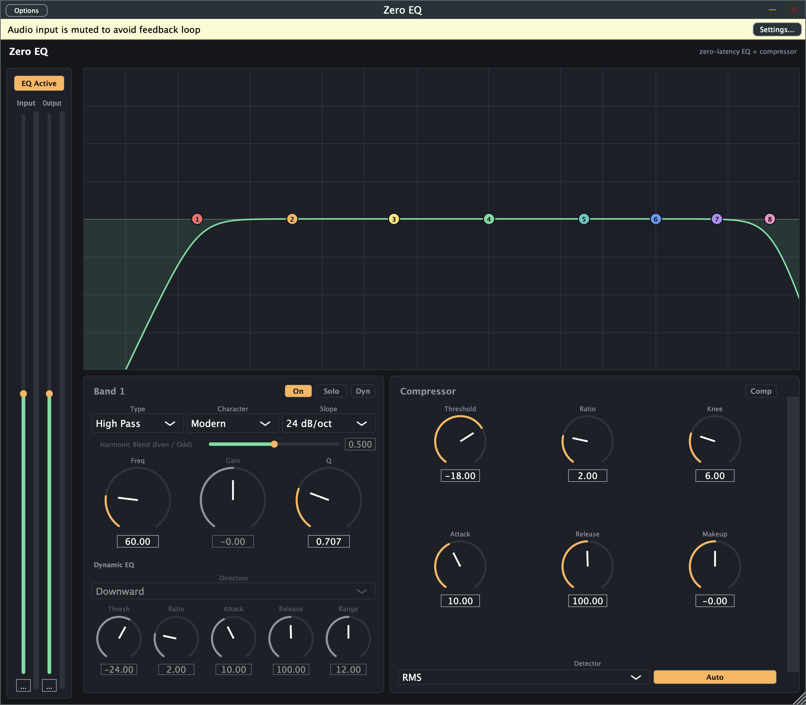
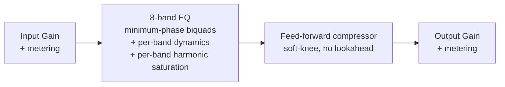

# Zero EQ

> **AI-assisted project.** This codebase was created with [Claude](https://claude.com/claude-code)
> (Anthropic), directed and reviewed by a human author. The DSP has been verified
> analytically (filter math checked against the RBJ/Butterworth cookbook formulas) and
> against real audio (throwaway numeric test harnesses processing real signals through
> the actual shipped processor class, not just static curve math — including FFT-verified
> harmonic content for the saturation stage), `pluginval` passes clean on VST3 and passes
> on AU with one known benign warning (see Status), and it's been loaded and hosted
> successfully in REAPER. It has **not** been used on real hardware in a live signal
> chain yet. Review before use on live gear.

A zero-added-latency parametric EQ + compressor VST3/AU plugin, built with JUCE.



*Real screenshot of the Standalone build.*

## Goals

- **Zero added latency** — every filter is minimum-phase IIR (biquads); no lookahead,
  no linear-phase FFT convolution, no oversampling, no internal buffering beyond the
  host's block size. Safe to track through in a live/monitoring signal chain.
- **Node-based curve workflow** — draggable per-band nodes over a live pre/post spectrum
  analyzer. Drag = frequency/gain, scroll = Q, double-click = add/toggle a band.
- **Dynamic EQ bands** — any gain-having band (Bell/Shelf/Tilt) can be switched into
  dynamic mode: it gets its own threshold/ratio/attack/release/range and behaves as a
  frequency-selective compressor (duck when that band gets loud) or expander (boost
  when that band gets quiet), instead of sitting at a fixed static gain. Detection runs
  on the signal already in the chain by default — no lookahead, no added latency — or,
  per band, on an external sidechain input instead.
- **Three per-band characters** — Modern (independent Q, textbook response), Vintage
  (proportional Q that widens with applied gain, approximating passive/console-style
  musical EQs such as Cranborne Audio's Harmonic EQ), and Harmonic (adds gain-driven
  even/odd harmonic saturation on top of the Modern-style linear response). Vintage and
  Harmonic are original approximations of that *behaviour*, not circuit models or clones
  of any specific product.
- **Input/output trim** with metering, plus a post-EQ feed-forward compressor
  (soft-knee, peak/RMS detection, no lookahead — also zero added latency).
- **Presets** — 7 factory presets covering every feature area (static EQ shaping,
  dynamic EQ, harmonic saturation, compressor-forward), plus save/load of your own
  presets to the standard per-user preset directory. Factory presets double as the
  plugin's VST3/AU host "program" list.
- **Ballistics-accurate metering** — input/output meters combine a fast peak read,
  a slower VU-style integrating level, a 4x-oversampled true-peak estimate that
  catches inter-sample peaks a plain sample read would miss, and a held clip
  indicator, all on a read-only side path that can't add latency to the signal
  actually being processed.

## Roadmap

- [x] **Dynamic EQ bands** — shipped. Per-band threshold/ratio/attack/release/range,
  selectable Downward (duck) or Upward (boost) direction.
- [x] **Harmonic-based EQ** — shipped. A third per-band character that layers gain-driven
  even/odd harmonic saturation on top of the standard linear response, with a per-band
  blend control between the two harmonic families.
- [x] **Preset system** — shipped. 7 factory presets plus user preset save/load.
- [x] **Ballistics-accurate metering** — shipped. Peak, VU, true-peak-estimate, and
  held clip indication on the input/output meters, replacing the earlier raw
  peak-only reads.
- [x] **External sidechain input for dynamic EQ** — shipped. An optional stereo
  sidechain bus, with a per-band toggle so any dynamic band can detect against that
  external signal instead of the internal chain.

All five landed without compromising the zero-added-latency guarantee that's the
whole point of this plugin. Next up: whatever the next real driver of this project
turns out to be — nothing currently queued.

## Signal chain



Each EQ band's own dynamic detector reads the signal as it arrives at that band's
position in the chain (post every earlier band, pre this one) and modulates that
band's gain in real time. The Harmonic character's saturation stage runs immediately
after that same band's linear filter, so it colors only what that band actually
touches. Still just one pass through the chain, no lookahead anywhere.

## Dynamic EQ visual feedback

Dynamic bands get three layered visual cues on the main curve so you can read what's
actually happening without opening the band panel:

- **Range envelope** — a soft shaded region showing the full swing a dynamic band could
  reach (static gain out to its configured Range, in its Downward/Upward direction).
  Purely a function of the band's own settings, so it's visible even on silence.
- **Live curve** — a second curve, drawn on top of the static one, showing the actual
  instantaneous total gain (static + live dynamic delta) across the whole spectrum. It
  visibly moves in real time as the signal pushes each dynamic band's detector, with the
  gap between it and the static curve filled in to make the current deviation obvious
  at a glance.
- **Node engagement glow** — each dynamic band's node ring brightens and thickens in
  proportion to how hard it's currently working (current delta relative to its Range),
  so an idle dynamic band reads as a faint outline and an actively-ducking/boosting one
  visibly glows.

## Building

Requires CMake 3.22+ and a C++20 compiler (Xcode Command Line Tools on macOS).
JUCE is fetched automatically via CMake `FetchContent` on first configure.

```sh
cmake -B build -G Ninja -DCMAKE_BUILD_TYPE=Release
cmake --build build
```

Build products (VST3 / AU / Standalone) land in `build/ZeroEQ_artefacts/`.

## EQ bands

Each of the 8 bands supports: Bell, Low Shelf, High Shelf, High Pass, Low Pass, Notch,
Band Pass, and Tilt Shelf, with a selectable slope (12/24/36/48 dB/oct) for the HP/LP
types and a Modern/Vintage/Harmonic character switch for the rest.

Bell/Shelf/Tilt bands can additionally be switched into **dynamic mode**: threshold,
ratio, attack, release, and a max-range clamp, with a Downward (duck) or Upward (boost)
direction. The detector filters a copy of the signal through a type-appropriate analysis
shape (band-pass at the band's freq/Q for Bell/Tilt, high-pass at the corner for High
Shelf, low-pass at the corner for Low Shelf) to isolate "the region this band affects,"
then envelope-follows that to drive the gain modulation. This is a practical
approximation for isolating a band's spectral region, not a claim of matching any
specific commercial dynamic EQ's exact detection algorithm.

Each dynamic band also has its own **Sidechain** toggle: leave it off and the band
detects against the signal already in the chain (the default); turn it on and it
detects against the plugin's dedicated stereo sidechain input bus instead — useful
for, say, ducking a bed track off a separate voice input. The toggle falls back to
internal detection automatically (rather than detecting against silence) whenever
the host hasn't actually connected the sidechain bus, and its label switches to
"Sidechain (n/c)" in that case so it's obvious from the GUI. The sidechain bus adds
no channels to, and never writes to, the main signal path — it's a read-only
detection input, so it doesn't touch the zero-added-latency guarantee either.

The **Harmonic** character blends between two waveshapers driven by how much gain the
band is applying (a band left at 0dB stays transparent even in Harmonic mode): an
asymmetric quadratic shaper that generates warm, tube-like even harmonics (plus a DC
blocker, since asymmetric shaping introduces a DC offset), and a tanh shaper that
generates grittier, transistor-like odd harmonics. A per-band blend slider crossfades
between them. Both use first-order antiderivative anti-aliasing (ADAA) rather than
oversampling — the waveshaper's antiderivative is evaluated across the current and
previous sample instead of the raw function at the current sample, which suppresses
aliasing from the nonlinearity without needing lookahead or extra latency.

## Presets

7 factory presets, each starting from a full reset-to-defaults so every parameter not
mentioned below stays at its default:

| Preset | Showcases |
| --- | --- |
| Init | Flat/default state, useful as a starting point or reference |
| Vocal Presence | Static EQ shaping — low-mid cut, presence bump, air shelf |
| De-Esser (Dynamic) | A single dynamic downward band tuned to catch sibilance |
| Warm Bus (Harmonic) | Harmonic character on two bands (even-leaning low end, odd-leaning top) plus gentle bus compression |
| Podcast Voice | HPF + presence + a dynamic band taming harshness + compressor, combined |
| Broadcast Loudness | Compressor-forward: higher ratio, faster attack/release, auto makeup |
| Telephone / Lo-Fi | Aggressive band-limiting + heavily-driven Harmonic character for creative use |

User presets save to the standard per-user preset directory
(`~/Library/Audio/Presets/Allan Sargeant/Zero EQ/` on macOS) as plain APVTS-state XML —
the same save/restore path a host already uses for session recall, so there's no
separate preset format to keep in sync. Factory presets also drive the plugin's
VST3/AU "program" list, so a host's own program-switching UI works too.

## Metering

Input and output each get their own read-only `LevelMeter` instance sitting after
that stage's gain trim — it reads a copy of the buffer and never touches the actual
signal, so nothing it does can add latency:

- **Peak** — instant attack, ~20dB/s exponential release. A fast-peak-meter
  approximation, not a claim of matching a specific broadcast PPM's exact spec.
- **VU** — a one-pole RMS-based integrator tuned for ~300ms to reach 99% of a step,
  approximating classic VU ballistics (not a model of a real meter's needle physics).
- **True peak** — a lightweight 4x-oversampled estimate using Catmull-Rom cubic
  interpolation between samples, catching inter-sample peaks a plain sample-peak
  read misses. A practical estimate, not a full ITU-R BS.1770-compliant filter.
- **Clip indicator** — held for ~1.5s so a brief clip stays visible, triggered at a
  small headroom margin below exact 0dBFS rather than an exact `>= 1.0` check (a
  nominally unity-gain stage isn't always bit-exact 1.0 after a normalized-parameter
  round-trip, so a razor-edge threshold can miss a genuinely full-scale sample).

## Status

Phase 6: DSP engine, dynamic EQ (with optional external sidechain detection),
harmonic saturation, presets, ballistics-accurate metering, and full interactive GUI
(spectrum analyzer, draggable curve, preset bar, band/compressor/IO panels, live
dynamic-gain indicators). Verified via `pluginval` (VST3 + AU, strictness 5 — VST3
clean; AU passes with one known benign warning, see below), hosted successfully in
REAPER, and checked against real audio through the actual shipped processor class —
including an FFT check confirming the even/odd harmonic generators each produce
exactly the harmonic content they're supposed to and nothing else, a full sweep
confirming every factory preset applies correctly, produces finite (no NaN) audio and
reports zero added latency, a metering pass confirming peak attack/release timing, VU
ballistics, true-peak inter-sample detection, and clip-indicator hold time all match
their intended behaviour on known test signals, and a sidechain pass confirming a
dynamic band tracks the external sidechain signal (not the internal one) when its
toggle is on, tracks the internal signal steadily when it's off, and falls back to
internal detection cleanly when sidechain audio isn't actually connected. See open
items below for what's still outstanding.

**Known benign AU warning**: `pluginval`'s "Disabling non-main buses" check fails on
the AU build (Apple's own `auval` validator still passes with exit code 0, and every
other check — including enabling all buses and restoring the default layout — passes
clean). This is a documented JUCE/AudioUnit interaction: AUv2's bus-disable semantics
for auxiliary/sidechain input buses don't round-trip the same way pluginval expects,
independent of what the plugin itself does; it's a widely reported quirk for AU
plugins with a sidechain bus, not a Zero EQ-specific bug.

### Known limitations / next steps

- [ ] Not yet tested against real (non-silent) audio hardware in a live signal chain.
- No linear-phase mode — intentionally out of scope (zero latency was the explicit goal).
