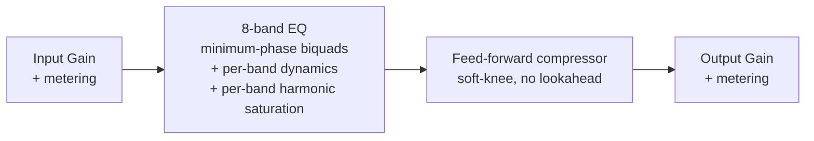

# Zero EQ

> **AI-assisted project.** This codebase was created with [Claude](https://claude.com/claude-code)
> (Anthropic), directed and reviewed by a human author. The DSP has been verified
> analytically (filter math checked against the RBJ/Butterworth cookbook formulas) and
> against real audio (throwaway numeric test harnesses processing real signals through
> the actual shipped processor class, not just static curve math — including FFT-verified
> harmonic content for the saturation stage), `pluginval` passes clean on both VST3 and
> AU, and it's been loaded and hosted successfully in REAPER. It has **not** been used on
> real hardware in a live signal chain yet. Review before use on live gear.

A zero-added-latency parametric EQ + compressor VST3/AU plugin, built with JUCE.


*Real screenshot of the Standalone build.*

## Goals

- **Zero added latency** — every filter is minimum-phase IIR (biquads); no lookahead,
  no linear-phase FFT convolution, no oversampling, no internal buffering beyond the
  host's block size. Safe to track through in a live/monitoring signal chain.
- **Node-based curve workflow** — draggable per-band nodes over a live pre/post spectrum
  analyzer. Drag = frequency/gain, scroll = Q, double-click = add/toggle a band.
- **Dynamic EQ bands** — any gain-having band (Bell/Shelf/Tilt) can be switched into
  dynamic mode: it gets its own threshold/ratio/attack/release/range and behaves as a
  frequency-selective compressor (duck when that band gets loud) or expander (boost
  when that band gets quiet), instead of sitting at a fixed static gain. Detection runs
  on the signal already in the chain — no lookahead, no added latency.
- **Three per-band characters** — Modern (independent Q, textbook response), Vintage
  (proportional Q that widens with applied gain, approximating passive/console-style
  musical EQs such as Cranborne Audio's Harmonic EQ), and Harmonic (adds gain-driven
  even/odd harmonic saturation on top of the Modern-style linear response). Vintage and
  Harmonic are original approximations of that *behaviour*, not circuit models or clones
  of any specific product.
- **Input/output trim** with metering, plus a post-EQ feed-forward compressor
  (soft-knee, peak/RMS detection, no lookahead — also zero added latency).

## Roadmap

- [x] **Dynamic EQ bands** — shipped. Per-band threshold/ratio/attack/release/range,
  selectable Downward (duck) or Upward (boost) direction, internal detection only
  (no external sidechain input yet).
- [x] **Harmonic-based EQ** — shipped. A third per-band character that layers gain-driven
  even/odd harmonic saturation on top of the standard linear response, with a per-band
  blend control between the two harmonic families.

Both landed without compromising the zero-added-latency guarantee that's the whole
point of this plugin. Next up: whatever the next real driver of this project turns out
to be — nothing currently queued.

## Signal chain



Each EQ band's own dynamic detector reads the signal as it arrives at that band's
position in the chain (post every earlier band, pre this one) and modulates that
band's gain in real time. The Harmonic character's saturation stage runs immediately
after that same band's linear filter, so it colors only what that band actually
touches. Still just one pass through the chain, no lookahead anywhere.

## Dynamic EQ visual feedback

Dynamic bands get three layered visual cues on the main curve so you can read what's
actually happening without opening the band panel:

- **Range envelope** — a soft shaded region showing the full swing a dynamic band could
  reach (static gain out to its configured Range, in its Downward/Upward direction).
  Purely a function of the band's own settings, so it's visible even on silence.
- **Live curve** — a second curve, drawn on top of the static one, showing the actual
  instantaneous total gain (static + live dynamic delta) across the whole spectrum. It
  visibly moves in real time as the signal pushes each dynamic band's detector, with the
  gap between it and the static curve filled in to make the current deviation obvious
  at a glance.
- **Node engagement glow** — each dynamic band's node ring brightens and thickens in
  proportion to how hard it's currently working (current delta relative to its Range),
  so an idle dynamic band reads as a faint outline and an actively-ducking/boosting one
  visibly glows.

## Building

Requires CMake 3.22+ and a C++20 compiler (Xcode Command Line Tools on macOS).
JUCE is fetched automatically via CMake `FetchContent` on first configure.

```sh
cmake -B build -G Ninja -DCMAKE_BUILD_TYPE=Release
cmake --build build
```

Build products (VST3 / AU / Standalone) land in `build/ZeroEQ_artefacts/`.

## EQ bands

Each of the 8 bands supports: Bell, Low Shelf, High Shelf, High Pass, Low Pass, Notch,
Band Pass, and Tilt Shelf, with a selectable slope (12/24/36/48 dB/oct) for the HP/LP
types and a Modern/Vintage/Harmonic character switch for the rest.

Bell/Shelf/Tilt bands can additionally be switched into **dynamic mode**: threshold,
ratio, attack, release, and a max-range clamp, with a Downward (duck) or Upward (boost)
direction. The detector filters a copy of the signal through a type-appropriate analysis
shape (band-pass at the band's freq/Q for Bell/Tilt, high-pass at the corner for High
Shelf, low-pass at the corner for Low Shelf) to isolate "the region this band affects,"
then envelope-follows that to drive the gain modulation. This is a practical
approximation for isolating a band's spectral region, not a claim of matching any
specific commercial dynamic EQ's exact detection algorithm.

The **Harmonic** character blends between two waveshapers driven by how much gain the
band is applying (a band left at 0dB stays transparent even in Harmonic mode): an
asymmetric quadratic shaper that generates warm, tube-like even harmonics (plus a DC
blocker, since asymmetric shaping introduces a DC offset), and a tanh shaper that
generates grittier, transistor-like odd harmonics. A per-band blend slider crossfades
between them. Both use first-order antiderivative anti-aliasing (ADAA) rather than
oversampling — the waveshaper's antiderivative is evaluated across the current and
previous sample instead of the raw function at the current sample, which suppresses
aliasing from the nonlinearity without needing lookahead or extra latency.

## Status

Phase 3: DSP engine, dynamic EQ, harmonic saturation, and full interactive GUI
(spectrum analyzer, draggable curve, band/compressor/IO panels, live dynamic-gain
indicators). Verified via `pluginval` (VST3 + AU, strictness 5, clean), hosted
successfully in REAPER, and checked against real audio through the actual shipped
processor class — including an FFT check confirming the even/odd harmonic generators
each produce exactly the harmonic content they're supposed to and nothing else. See
open items below for what's still outstanding.

### Known limitations / next steps

- [ ] Add a preset / factory-bank system.
- [ ] Ballistics-accurate metering (true-peak / standardized VU/PPM) — current meters are simple peak reads.
- [ ] Dynamic EQ: no external sidechain input yet (internal detection only).
- [ ] Not yet tested against real (non-silent) audio hardware in a live signal chain.
- No linear-phase mode — intentionally out of scope (zero latency was the explicit goal).
